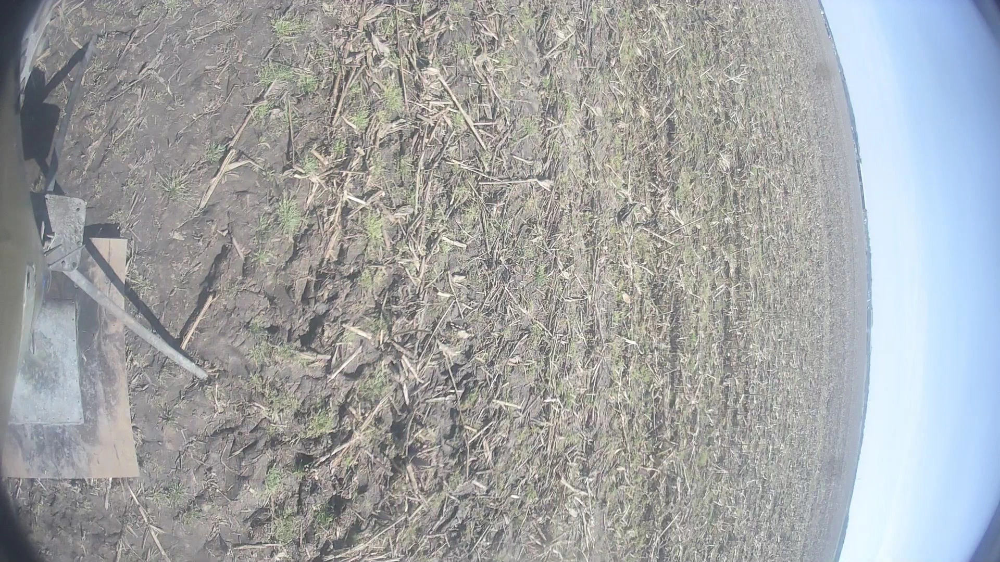
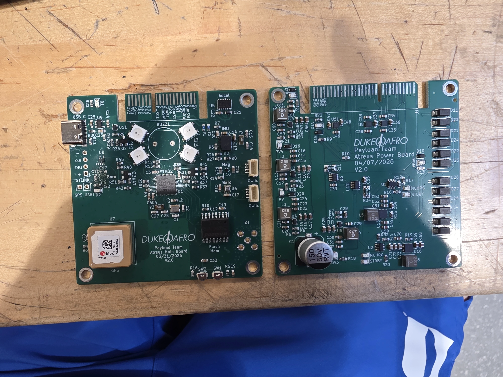

import BeforeAfter from "~/components/ui/BeforeAfter.astro";
import oldSite from "./assets/aero-redesign/before.webp";
import newSite from "./assets/aero-redesign/after.webp";

Duke AERO is Duke University's premier aerospace society, building rockets since 2018. Unlike many other teams, our rockets are fully SRAD (Student Research and Developed), meaning we manage the rocket from beginning to end and top to bottom.

At the 2026 IREC competition, we placed 3rd in our category, reaching an apogee just shy of 30,000 ft. The rocket flew with a flight computer which I helped program, using a transmission protocol I developed, flying with a payload whose flight computer I fully programmed and partially designed. Click to read more about [Devil's Advocate](https://dukerocketry.com/past-projects/devils-advocate/), our 2026 rocket.

For the 2026-2027 school year, we have ambitious plans, attempting a two-stage rocket to reach an apogee of 45,000 ft.

Below you'll find a list of projects I took on, with a short brief.

# Website Redesign

<BeforeAfter
  before={oldSite}
  after={newSite}
  beforeAlt="Original site homepage"
  afterAlt="Redesigned homepage"
  caption="Hero page redesign, 2026"
/>

Compare it yourself, the old site [here](https://duke-aero-website-july-2024.pages.dev/), and the new site is live at [dukerocketry.com](https://dukerocketry.com/team/). From initial Figma sketch to final deliverable, I spent around 6 months redesigning every page to fit a coherent space theme. The landing page takes you down a journey of the entire rocket, showcasing each subteam with slick animations, something missing from the original site. A total of 6 main pages, plus one page per past rocket was created. Data is backed by YAML files and markdown files to make editing a breeze for non-technical members.

A separate post on this will be made soon.

# Live Video

Attempting to build a system to transmit live video with over 6 miles of range, featuring a custom video pipeline consisting of ffmpeg, a custom Rust program, and GNURadio.
The system has been tested in a large nearby park, but not yet incorporated into the rocket (planned for 2026-2027 year).

Read the [technical description post](https://derock.blog/post/aero-video-link).

# Payload Flight Computer

Payload's flight computer runs software completely written by me, utilizing FreeRTOS to handle concurrent LoRA transmissions, flash data logging, sensor polling, and general state management. This STM32F411-based board is supplemented by a custom designed Power Board with multiple rails for different voltages. It also handles battery charging, where I designed a rectifier network to harvest energy from a free spinning three-phase motor upon decent.

Full specifications can be found on the [Duke Rocketry Docs](https://docs.dukerocketry.com/s/4a4130bd-efc9-4036-b1f9-cb79507aa73b).
