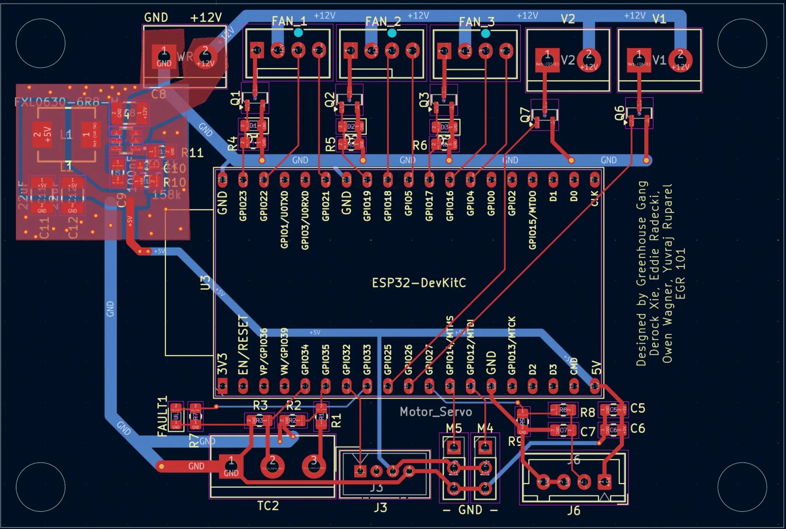

import { Image } from "astro:assets";
import pcbReroute from "./assets/chamber-retrofit/pcb-reroute.webp";
import graphs from "./assets/chamber-retrofit/graphs.webp";

The Duke Phytotron building houses sixteen 1960s-era "R" type environmental
growth chambers that are critical for biological research but completely lack
humidity control systems. This limits the types of experiments researchers can
perform, as they cannot control environmental variables as precisely as in
modern chambers.


Existing commercial solutions are either too expensive, large, or rely on
proprietary technology that doesn't play nicely with the existing equipment. The
facility manager needs a custom retrofit that interfaces seamlessly with the
existing systems while retaining afforability and ease of maintenance.

A summary of our design criteria, testing, and system breakdown can be found on
[this poster](https://google.com/REPLACE_ME).

Out of the three design blocks--Humidification, Dehumidification, and
Controls--I mainly worked on the Control subsystem, with my teammates working on
the designs.

# Control's PCB

Our system contains multiple servos, fans, sensors, and other hardware that need
to be controlled. Since our client will ultimately require 16 retrofits (one per
chamber), I decided to design a PCB using KiCad:



On the input side,

- 12V input to power the board. This is fed into a buck converter which is set
  to output 5V DC for the ESP32, servos, and select sensors.
- Terminal block for connection to the TC2 Microcontroller. This is the existing
  computer on the R2 chamber, which manages the setpoint and reading the sensor.
  It outputs analog signals, in the form of a 0-10V line and a 4-20mA line. A
  simple voltage divider and shunt resistor was used so the ESP32's ADC could
  read the data.
- 4pin JST-XH for the water level sensor (J6). A bank of capacitors was used as
  a hardware debounce, and a voltage divider was included to reduce the 5V high
  of the sensor to 3.3v for the ESP32.

On the output side:

- Three fan connectors. Each fan's PWM pin was connected to the ESP32 for fine
  fan speed control. A MOSFET was also included per fan to fully stop the fan by
  disabling power. The fan's TACH pin was hooked up to an interrupt pin for the
  ESP32 to monitor fan speed.
- Two solenoid valve connectors. A simple MOSFET was used to turn open and close
  the solenoid valve.
- Grove Atomizer port (J3). The Grove Atomizer includes a breakout board to
  handle the power switching for the piezoelectric humidifier. The connector was
  simply hooked up to 5V power and to a GPIO for control.
- 3pin headers for servos (M4 and M5). These are simple 9g servos, with a PWM
  input and 5V power input.

A large slot was included for the ESP32 Devkit C to slot in. Using the devkit
was chosen for simplicity and since ESP32's were readily available at Duke's
makerspace.

## Lesson Learnt

A big oversight when building the PCB was forgetting to check which pins the
ESP32 uses for it's internal SPI Flash. I had already made sure not to input the
analog signals onto any pins handled by ADC2 since those readings are unstable
when the ESP32's wifi is enabled, but had forgotten about the ESP32's other
strapping pins. It wasn't until I was trying to figure out why the ESP kept
panicking on boot, when I realized that I had accidentally attached a device to
the SPI flash pin and reconfigured it, preventing the ESP from reading the
program code.

As a result, a quick hacky solder job was required to reroute some traces (which
has since been fixed in the schematic).

<Image
  src={pcbReroute}
  alt="Jumping pins on the ESP"
  width="300"
  class="mx-auto"
/>

## Programming

The ESP32's program was written using C++ using the ESP-IDF framework. The
program runs a simple Finite State Machine (FSM) for the FSM's simplicity and
robustness.

```kroki type=graphviz classnames="mx-auto" alt="State Machine: Idle -> Humidify/Dehumidify Prep -> Humidify/Dehumidify"
digraph StateMachine {
  bgcolor="#00000000";
  rankdir=LR;

  node [shape=box, style="filled,rounded", fillcolor="#2d2d2d", fontcolor="white", fontname="Arial", color="#555"];
  edge [color="#cccccc", fontname="Arial"];

  { rank=min; Idle; }

  subgraph cluster_humid {
    style=invis;
    HumidifyPrep -> Humidify;
  }

  subgraph cluster_dehumid {
    style=invis;
    DehumidifyPrep -> Dehumidify;
  }

  Idle -> HumidifyPrep;
  Idle -> DehumidifyPrep;

  Humidify -> Idle [headport=n];
  Dehumidify -> Idle [headport=s];

  Humidify -> DehumidifyPrep [constraint=false];
  Dehumidify -> HumidifyPrep [constraint=false];
}
```

There is also a Fault state that can be transitioned to from any state. The prep
stages are used to prepare servo positions and ensure everything is in a
consistent state to prevent any edge cases from showing up in the long-term
operation of the device. The prep stages can't be interrupted.

The state logic runs in a loop, and will also perform checks against the TC2
data (checking the current humidity error) and transition if needed.

## Data Logging

We also needed a way to log the chamber data so we can benchmark our solution.
To achieve this, I connected the ESP32 to Wifi and created a quick
[n8n](https://n8n.io/) workflow to receive POST requests and append a row onto a
Google sheet.

<div class="px-4">
  <Image
    alt="Humidity vs Time graphs for both humidification and dehumidification tests"
    src={graphs}
  />
</div>

## Getting the TC2 Output

The TC2 Microcontroller has 4 analog output pins that we can read: Top line
control, Top line, Mid line control, and Mid line. The control pins output 0-10V
DC, and the other lines output 4-20mA. Top line refers to the "Top" sensor,
which in our case is a temperature probe. The Mid line refers to the second
"Mid" sensor, which is the humidity sensor. It is possible to configure the TC2
to output a signal directly proportional to the sensor input, in a mode known as
"direct drive mode". This would have been great! We could get the actual sensor
reading using direct drive, then have the TC2 output the setpoint over the other
line.

But unfortunately, enabling direct drive disables the TC2's ability to handle
setpoints at all. In a normal scenario, a TC2 operator can adjust the setpoint
humidity and create timers to update the setpoint to create a fluctuating
environment. But in direct drive mode, all of this functionality is disabled.

With direct drive disabled, the Mid line outputs the setpoint, with none of the
outputs showing the actual humidity level. In order to control the system, we
need both. After a bit of testing, the solution I came up with was to enable the
Control output and configure a PID output setting with only a kP gain, so that
the output was directly proportional to the error. An offset was added so that
5V meant 0 error, and any voltage higher meant positive error and any voltage
below meant negative error.

## Postmortem

We went into this project with a lot of ambition, researching and comparing all
the different humidification and dehumidification methods: steam, nozzle,
condenser, and many more. But due to complexity, we landed on a system using an
atomizer and renewable desiccant. I'm quite proud of what we were able to build
within the span of just a single semester, and have learned a lot about PCB
design and creating control algorithms. This project was the first time I got a
PCB manufactured, and it's really cool to see the circuit work, especially the
buck converter.
